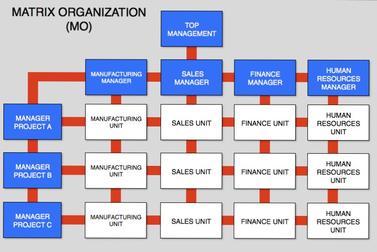

# Large-Scale Scrum (More with less)

Craig Larman & Bas Vodde

Addison-Wesley 2017

## Preface

Power in the marketplace moved from seller to buyer, the customer, not the firm, became the center of commercial universe.

LeSS shows how to **handle large and complex development.**

LeSS strives for a balance between abstract principles and concrete practices.

LeSS is not process or technique it is framework.

**Product group not project group - emphasises product and customer.**

**Matrixed project organisation should not exist in LeSS Line organisation**

**Line manager** - a manager you report to in the line of organisation.
First-level manager - is the direct line manager you report to.

**Senior manager/Executive** - Manager near the top of org. 

**Product management or product marketing** - Explore the market and decide on the content of the product. This is not in line with relation with teams.

**Head of product group** - The manager who heads the product group to which all people in the product group report in a line relationship.

**Project/program manager** - Role traditionally responsible for the schedule of a release. This is normally not a line relationship with the team as it has a short-term temporary focus. **These roles should not exist in a LeSS organization.**

**Functional organization** - Line organization for a functional skill such as development, test, or analysis. **Should cease to exist in a LeSS organization.**

## LeSS

### One-team Scrum

Each **timeboxed** Sprint, a potentially **shippable product** increment is delivered and, ideally, shipped. A **single Product Owner** is responsible for maximizing product value, prioritizing items in the **Product Backlog**, and adaptively deciding the goal of each Sprint based on constant feedback and learning. A small Team is responsible for delivering the Sprint goal; there are no limiting single-specialized roles. A **Scrum Master** teaches why Scrum and how to derive value with it, coaches the Product Owner, Team, and organization to apply it, and acts as a mirror. **There is no project manager or team lead.**

In the Scrum Guide and Scrum Primer, the **emphasis is for one Team**; the focus is not many Teams working together. And that naturally leads to thinking about large-scale Scrum.

**LeSS is Scrum applied to many teams working together on one product.**

...applied to many teams—Cross-functional, cross-component, **full-stack feature teams** of 3–9 **learning-focused people** that **do it all**—from UX to code to videos—to create done items and a shippable product.

...working together—The teams are working together because they have a common goal to deliver one common shippable product at the end of a common Sprint, and each team cares about this because they are a feature team responsible for the whole, not a part.

...on one product—What product? A broad complete **end-to-end customer-centric solution that real customers use**. It’s not a component, platform, layer, or library.

Today, the two LeSS frameworks (smaller LeSS and LeSS Huge) have been adopted in big groups worldwide in disparate domains.

There are no such things as best practices in product development. There are only practices that are adequate within a certain context.

**We don’t want more roles because more roles leads to less responsibility to Teams**. 

**We don’t want more artifacts because more artifacts leads to a greater distance between Teams and customers**.

**We don’t want more process because that leads to less learning and team ownership of process.** 
Instead **we want more responsible Teams by having less (fewer) roles,we want more customer-focused Teams** building useful products by **having less artifacts**, we want more **Team ownership of process** and **more meaningful work by having less defined processes**. We want more with less.

**Whole-product focus** — One Product Backlog, one Product Owner, one shippable product, one Sprint—regardless if 3 or 33 teams. Customers want valuable functionality in a cohesive product, not technical components in separate parts.

**Customer-centric — Focus** on learning the customers real problems and solving those. Identify value and waste in the eyes of the paying customers. Reduce wait time from their perspective. Increase and strengthen feedback loops with real customers. Everyone understands how their work today directly relates to and benefits paying customers.

**Continuous improvement towards perfection** — Here’s a perfection goal: Create and deliver a product almost all the time, at almost no cost, with no defects, that delights customers, improves the environment, and makes lives better. Do endless humble and radical improvement experiments toward that goal.

**Lean thinking** — Create an organizational system whose foundation is **managers-as-teachers who apply and teach lean thinking**, manage to improve, promote stop-and-fix, and who practice Go See. Add the two pillars of respect for people and continuous challenge-the-status-quo improvement mindset. All towards the goal of perfection.

**Systems thinking** — **See, understand, and optimize the whole system** (not parts), and use systems modeling to explore system dynamics. Avoid the local sub-optimizations of focusing on the efficiency or productivity of individuals and individual teams. Customers care about the overall concept-to-cash cycle time and flow, not individual steps, and locally optimizing a part almost always sub-optimizes the whole.

**Empirical process control** — Continually inspect and adapt the product, processes, behaviors, organizational design, and practices to evolve in situationally-appropriate ways. Do that, rather than follow a prescribed set of so-called best practices that ignore context, create ritualistic following, impede learning and change, and squash people’s sense of engagement and ownership.

**Queuing theory** — Understand how systems with queues behave in the R&D domain, and apply those insights to managing queue sizes, work-in-progress limits, multitasking, work packages, and variability.

Large-Scale Scrum has two frameworks:
- LeSS. 2–8 Teams
- LeSS Huge. 8+ Teams

In any event, at some point, 
1. the single Product Owner can no longer grasp an overview of the entire product, 
2. the Product Owner can’t balance an external and internal focus, and 
3. the Product Backlog is so large that it becomes difficult for one person to work with. When the group hits that tipping point, 

it may be time to change from the smaller LeSS framework to LeSS Huge. On the other hand, we suggest first trying to get better, smaller, and simpler, before getting huger.

Common Across the Frameworks The LeSS and LeSS Huge frameworks share common elements:
- one Product Owner and one Product Backlog
- one common Sprint across all teams
- one shippable product increment
 
 
## LeSS Framework

The smaller LeSS framework is **for one (and only one) Product Owner** who owns the product, and who manages **one Product Backlog** worked on by teams in **one common Sprint**, optimizing for the whole product. The LeSS framework elements are about the same as one-team Scrum:

Roles—One Product Owner, two to eight Teams, a Scrum Master for one to three Teams. Crucially, these Teams are feature teams—true cross-functional and cross-component full-stack teams that work together in a shared code environment, each doing everything to create done items.

Artifacts—One potentially shippable product increment, one Product Backlog, and a separate Sprint Backlog for each Team.

Events—One common Sprint for the whole product; it includes all teams and ends in one potentially shippable product increment.

Rules & Guides—Rules for a barely sufficient scaling framework for empirical process control and whole-product focus. Guides may help.
