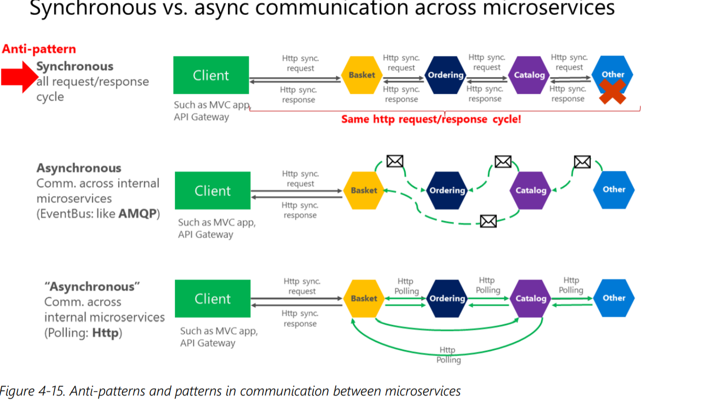
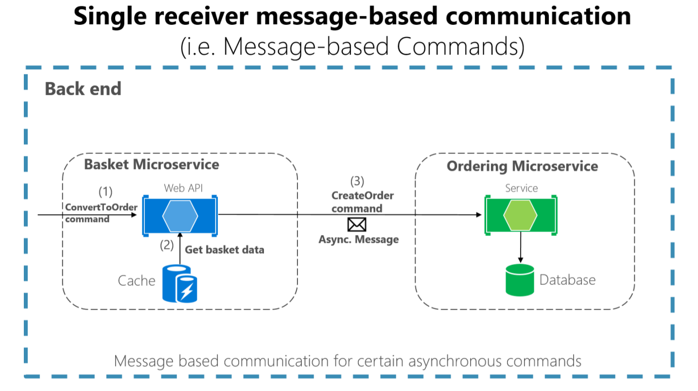
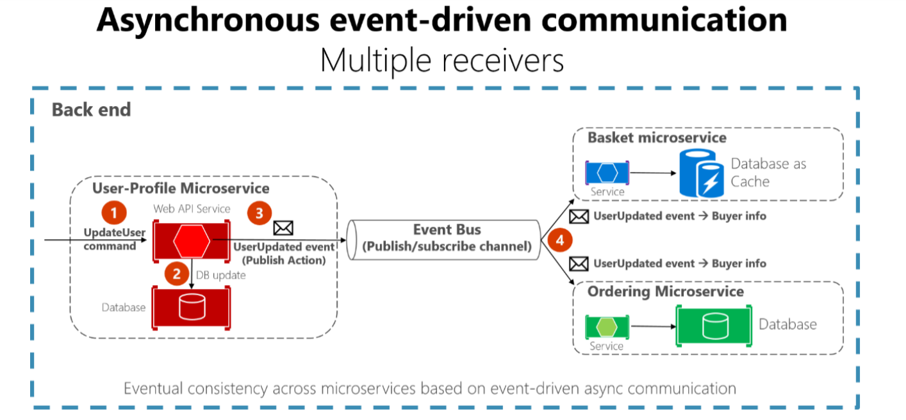
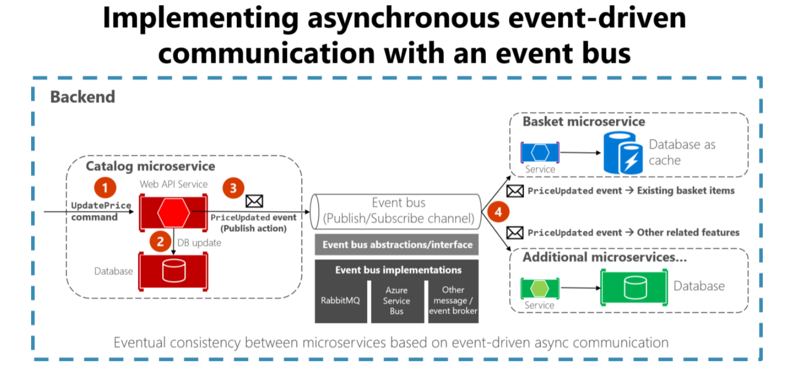

# NET-Microservices-Architecture-for-Containerized-NET-Applications

## Communication in a microservice architecture

A direct conversion from in-process method calls into RPC calls to services will cause a
chatty and not efficient communication that won’t perform well in distributed environments. The
challenges of designing distributed system properly are well enough known that there’s even a canon
known as the Fallacies of distributed computing that lists assumptions that developers often make
when moving from monolithic to distributed designs.


Services must interact using an inter-process communication protocol such as HTTP, AMQP, or a
binary protocol like TCP, depending on the nature of each service.


Each microservice owns its own data and its own domain logic.
But the microservices composing an end-to-end application are usually simply choreographed by using REST communications rather than complex protocols such as WS-* and flexible event-driven communications instead of centralized business-process-orchestrators.

The two commonly used protocols are HTTP request/response with resource APIs (when querying
most of all), and lightweight asynchronous messaging when communicating updates across multiple
microservices. 

### Communication types
Client and services can communicate through many different types of communication, each one
targeting a different scenario and goals. Initially, those types of communications can be classified in
two axes.
The first axis defines if the protocol is synchronous or asynchronous:

* Synchronous protocol. HTTP is a synchronous protocol. The client sends a request and waits for
a response from the service. That’s independent of the client code execution that could be
synchronous (thread is blocked) or asynchronous (thread isn’t blocked, and the response will
reach a callback eventually). The important point here is that the protocol (HTTP/HTTPS) is
synchronous and the client code can only continue its task when it receives the HTTP server
response.

* Asynchronous protocol. Other protocols like AMQP (a protocol supported by many operating
systems and cloud environments) use asynchronous messages. The client code or message
sender usually doesn’t wait for a response. It just sends the message as when sending a message
to a RabbitMQ queue or any other message broker.

The second axis defines if the communication has a single receiver or multiple receivers:
- Single receiver. Each request must be processed by exactly one receiver or service (aka Point-to-Point). An example
of this communication is the Command pattern.

- Multiple receivers. Each request can be processed by zero to multiple receivers. This type of
communication must be asynchronous. An example is the publish/subscribe mechanism used in
patterns like Event-driven architecture. This is based on an event-bus interface or message
broker when propagating data updates between multiple microservices through events; it’s
usually implemented through a service bus by using
topics and subscriptions.

A microservice-based application will often use a combination of these communication styles. The
most common type is single-receiver communication with a synchronous protocol like HTTP/HTTPS
when invoking a regular Web API HTTP service. Microservices also typically use messaging protocols
for asynchronous communication between microservices.

If possible, never depend on synchronous communication (request/response) between multiple
microservices, not even for queries. The goal of each microservice is to be autonomous and available
to the client consumer, even if the other services that are part of the end-to-end application are down
or unhealthy. If you think you need to make a call from one microservice to other microservices (like
performing an HTTP request for a data query) to be able to provide a response to a client application,
you have an architecture that won’t be resilient when some microservices fail.

Moreover, having HTTP dependencies between microservices, like when creating long
request/response cycles with HTTP request chains, as shown in the first part of the Figure 4-15, not
only makes your microservices not autonomous but also their performance is impacted as soon as
one of the services in that chain isn’t performing well.

The more you add synchronous dependencies between microservices, such as query requests, the
worse the overall response time gets for the client apps.



If your microservice needs to raise an additional action in another microservice, if possible, do not
perform that action synchronously and as part of the original microservice request and reply
operation. Instead, do it asynchronously (using asynchronous messaging or integration events,
queues, etc.). But, as much as possible, do not invoke the action synchronously as part of the original
synchronous request and reply operation.


And finally (and this is where most of the issues arise when building microservices), **if your initial
microservice needs data that’s originally owned by other microservices, do not rely on making
synchronous requests for that data.** Instead, replicate or propagate that data (only the attributes you
need) into the initial service’s database by using eventual consistency** (typically by using integration
events, as explained in upcoming sections).

You might **use any protocol to communicate and propagate data asynchronously across microservices**
in order to **have eventual consistency**. As mentioned, you could **use integration events** using an event
bus or **message broker** or you could even **use HTTP by polling** the other services instead. It doesn’t
matter. **The important rule is to not create synchronous dependencies between your microservices.**

See https://docs.microsoft.com/en-us/azure/architecture/patterns/category/messaging

### Asynchronous message-based communication

When changes occur, you need some way to reconcile changes across the different models. A solution is eventual consistency and
event-driven communication based on asynchronous messaging.

A client makes a command or a request to a service by sending it a message.
e. If the service needs to reply, it sends a different message back to the client. Since it’s a message-based communication, the client
assumes that the reply won’t be received immediately, and that there might be no response at all.

A message is composed by a header (metadata such as identification or security information) and a
body. Messages are usually sent through asynchronous protocols like AMQP.

The preferred infrastructure for this type of communication in the microservices community is a
lightweight message broker, which is different than the large brokers and orchestrators used in SOA.
In a lightweight message broker, the infrastructure is typically “dumb,” acting only as a message
broker, with simple implementations such as RabbitMQ.
In this scenario, most of the “smart” thinking still lives in the endpoints that are producing and consuming messages-that is, in the microservices.

Another rule you should try to follow, as much as possible, is to use only asynchronous messaging
between the internal services, and to use synchronous communication (such as HTTP) only from the
client apps to the front-end services (API Gateways plus the first level of microservices).

There are two kinds of asynchronous messaging communication: single receiver message-based
communication, and multiple receivers message-based communication.

#### Single-receiver message-based communication
Message-based asynchronous communication with a single receiver means there’s point-to-point
communication that delivers a message to exactly one of the consumers that’s reading from the
channel, and that the message is processed just once.

Single-receiver message-based communication is especially well suited for sending asynchronous
commands from one microservice to another.

Once you start sending message-based communication (either with commands or events), you should
avoid mixing message-based communication with synchronous HTTP communication.



When the commands come from client applications, they can be implemented as HTTP synchronous commands. You should use message-based commands when you need higher scalability or when you’re already in a message-based business process.

#### Multiple-receivers message-based communication

Your communication from the sender will be available to additional subscriber microservices or to external applications. That way,
additional subscribers can be added in the future without the need to modify the sender service. When you use a publish/subscribe communication, you might be using an event bus interface to
publish events to any subscriber.


When using asynchronous event-driven communication, a **microservice publishes an integration event when something happens within its domain and another microservice needs to be aware of it**, like a price change in a product catalog microservice.

 Additional microservices subscribe to the events so
they can receive them asynchronously. When that happens, the receivers might update their own
domain entities, which can cause more integration events to be published. 



Your implementation will determine what protocol to use for event-driven, message-based
communications. AMQP can help achieve reliable queued communication.
When you use an event bus, you might want to use an abstraction level (like an event bus interface)
based on a related implementation in classes with code using the API from a message broker like
RabbitMQ. Alternatively, you might want to use a
higher-level service bus like NServiceBus, MassTransit, or Brighter to articulate your event bus and
publish/subscribe system.

#### Resiliently publishing to the event bus

The following are a few ways to accomplish resiliently publishing integration event into the event bus, somehow based on transactions.
this, although there could be additional approaches as well.
- Using a transactional (DTC-based) queue like MSMQ. (However, this is a legacy approach.)
- Using transaction log mining.
- Using full Event Sourcing pattern.
- Using the Outbox pattern: a transactional database table as a message queue that will be the base for an event-creator component that would create the event and publish it (http://www.kamilgrzybek.com/design/the-outbox-pattern/)

### Implementing event-based communication between microservices (integration events)



As noted in the architecture section, you can choose from multiple messaging technologies for
implementing your abstract event bus. But these technologies are at different levels. For instance,
RabbitMQ, a messaging broker transport, is at a lower level than commercial products like Azure
Service Bus, NServiceBus, MassTransit, or Brighter. 


Integration events are used for bringing domain state in sync across multiple microservices or external
systems. This is done by publishing integration events outside the microservice. When an event is
published to multiple receiver microservices (to as many microservices as are subscribed to the
integration event), the appropriate event handler in each receiver microservice handles the event.
An integration event is basically a data-holding class, as in the following example:

```java
public class ProductPriceChangedIntegrationEvent : IntegrationEvent
{
 public int ProductId { get; private set; }
 public decimal NewPrice { get; private set; }
 public decimal OldPrice { get; private set; }
 public ProductPriceChangedIntegrationEvent(int productId, decimal newPrice,
 decimal oldPrice)
 {
 ProductId = productId;
 NewPrice = newPrice;
 OldPrice = oldPrice;
 }
}
```

The integration events can be defined at the application level of each microservice, so they are
decoupled from other microservices, in a way comparable to how ViewModels are defined in the
server and client. What is not recommended is sharing a common integration events library across
multiple microservices; doing that would be coupling those microservices with a single event
definition data library. You do not want to do that for the same reasons that you do not want to share
a common domain model across multiple microservices: microservices must be completely
autonomous.

https://github.com/dotnet-architecture/eShopOnContainers/tree/master/src/BuildingBlocks/EventBus

```java
public interface IEventBus
{
 void Publish(IntegrationEvent @event);
 void Subscribe<T, TH>() where T : IntegrationEvent where TH : IIntegrationEventHandler<T>;
 void SubscribeDynamic<TH>(string eventName) where TH : IDynamicIntegrationEventHandler;
 void UnsubscribeDynamic<TH>(string eventName) where TH : IDynamicIntegrationEventHandler;
 void Unsubscribe<T, TH>() where TH : IIntegrationEventHandler<T> where T : IntegrationEvent;
}
```

Let’s start with some implementation code for the event bus interface and possible implementations
for exploration purposes. The interface should be generic and straightforward, as in the following
interface.

The Subscribe methods (you can have several implementations depending on the arguments) are
used by the microservices that want to receive events. This method has two arguments. The first is the
integration event to subscribe to (IntegrationEvent). The second argument is the integration event
handler (or callback method), named IIntegrationEventHandler, to be executed when the receiver
microservice gets that integration event message.

https://github.com/dotnet-architecture/eShopOnContainers
https://github.com/dotnet-architecture/eShopOnContainers/blob/dev/src/BuildingBlocks/EventBus/EventBus/Abstractions/IEventBus.cs

In the code, the EventBusRabbitMQ class implements the generic IEventBus interface. 

https://github.com/dotnet-architecture/eShopOnContainers/blob/dev/src/BuildingBlocks/EventBus/EventBusRabbitMQ/EventBusRabbitMQ.cs

Implementing a simple publish method with RabbitMQ

## Designing atomicity and resiliency when publishing to the event bus

When you publish integration events through a distributed messaging system like your event bus, you
have the problem of atomically updating the original database and publishing an event (that is, either
both operations complete or none of them). For instance, in the simplified example shown earlier, the
code commits data to the database when the product price is changed and then publishes a
ProductPriceChangedIntegrationEvent message. Initially, it might look essential that these two
operations be performed atomically. However, if you are using a distributed transaction involving the
database and the message broker, as you do in older systems like Microsoft Message Queuing
(MSMQ), this is not recommended for the reasons described by the CAP theorem.
Basically, you use microservices to build scalable and highly available systems. Simplifying somewhat,
the CAP theorem says that you cannot build a (distributed) database (or a microservice that owns its
model) that is continually available, strongly consistent, and tolerant to any partition. You must
choose two of these three properties.
In microservices-based architectures, you should choose availability and tolerance, and you should
deemphasize strong consistency. Therefore, in most modern microservice-based applications, you
usually do not want to use distributed transactions in messaging, as you do when you implement
distributed transactions based on the Windows Distributed Transaction Coordinator (DTC) with
MSMQ.
Let’s go back to the initial issue and its example. If the service crashes after the database is updated
(in this case, right after the line of code with _context.SaveChangesAsync()), but before the integration
event is published, the overall system could become inconsistent. This might be business critical,
depending on the specific business operation you are dealing with.
As mentioned earlier in the architecture section, you can have several approaches for dealing with this
issue:
• Using the full Event Sourcing pattern.
• Using transaction log mining.
• Using the Outbox pattern. This is a transactional table to store the integration events (extending
the local transaction).
For this scenario, using the full Event Sourcing (ES) pattern is one of the best approaches, if not the
best. However, in many application scenarios, you might not be able to implement a full ES system. ES
means storing only domain events in your transactional database, instead of storing current state
data. Storing only domain events can have great benefits, such as having the history of your system
available and being able to determine the state of your system at any moment in the past. However,
implementing a full ES system requires you to rearchitect most of your system and introduces many
other complexities and requirements. For example, you would want to use a database specifically
made for event sourcing, such as Event Store, or a document-oriented database such as Azure 

Cosmos DB, MongoDB, Cassandra, CouchDB, or RavenDB. ES is a great approach for this problem, but
not the easiest solution unless you are already familiar with event sourcing.
The option to use transaction log mining initially looks very transparent. However, to use this
approach, the microservice has to be coupled to your RDBMS transaction log, such as the SQL Server
transaction log. This is probably not desirable. Another drawback is that the low-level updates
recorded in the transaction log might not be at the same level as your high-level integration events. If
so, the process of reverse-engineering those transaction log operations can be difficult.
A balanced approach is a mix of a transactional database table and a simplified ES pattern. You can
use a state such as “ready to publish the event,” which you set in the original event when you commit
it to the integration events table. You then try to publish the event to the event bus. If the publishevent action succeeds, you start another transaction in the origin service and move the state from
“ready to publish the event” to “event already published.”
If the publish-event action in the event bus fails, the data still will not be inconsistent within the origin
microservice—it is still marked as “ready to publish the event,” and with respect to the rest of the
services, it will eventually be consistent. You can always have background jobs checking the state of
the transactions or integration events. If the job finds an event in the “ready to publish the event”
state, it can try to republish that event to the event bus.
Notice that with this approach, you are persisting only the integration events for each origin
microservice, and only the events that you want to communicate to other microservices or external
systems. In contrast, in a full ES system, you store all domain events as well.
Therefore, this balanced approach is a simplified ES system. You need a list of integration events with
their current state (“ready to publish” versus “published”). But you only need to implement these
states for the integration events. And in this approach, you do not need to store all your domain data
as events in the transactional database, as you would in a full ES system.
If you are already using a relational database, you can use a transactional table to store integration
events. To achieve atomicity in your application, you use a two-step process based on local
transactions. Basically, you have an IntegrationEvent table in the same database where you have your
domain entities. That table works as an insurance for achieving atomicity so that you include persisted
integration events into the same transactions that are committing your domain data.
Step by step, the process goes like this:
1. The application begins a local database transaction.
2. It then updates the state of your domain entities and inserts an event into the integration event
table.
3. Finally, it commits the transaction, so you get the desired atomicity and then
4. You publish the event somehow (next).
When implementing the steps of publishing the events, you have these choices:
• Publish the integration event right after committing the transaction and use another local
transaction to mark the events in the table as being published. Then, use the table just as an 


artifact to track the integration events in case of issues in the remote microservices, and perform
compensatory actions based on the stored integration events.
• Use the table as a kind of queue. A separate application thread or process queries the
integration event table, publishes the events to the event bus, and then uses a local transaction
to mark the events as published.
Figure 6-22 shows the architecture for the first of these approaches


The approach illustrated in Figure 6-22 is missing an additional worker microservice that is in charge
of checking and confirming the success of the published integration events. In case of failure, that
additional checker worker microservice can read events from the table and republish them, that is,
repeat step number 2.
About the second approach: you use the EventLog table as a queue and always use a worker
microservice to publish the messages. In that case, the process is like that shown in Figure 6-23. This
shows an additional microservice, and the table is the single source when publishing events


For simplicity, the eShopOnContainers sample uses the first approach (with no additional processes or
checker microservices) plus the event bus. However, the eShopOnContainers is not handling all
possible failure cases. In a real application deployed to the cloud, you must embrace the fact that
issues will arise eventually, and you must implement that check and resend logic. Using the table as a
queue can be more effective than the first approach if you have that table as a single source of events
when publishing them (with the worker) through the event bus.


