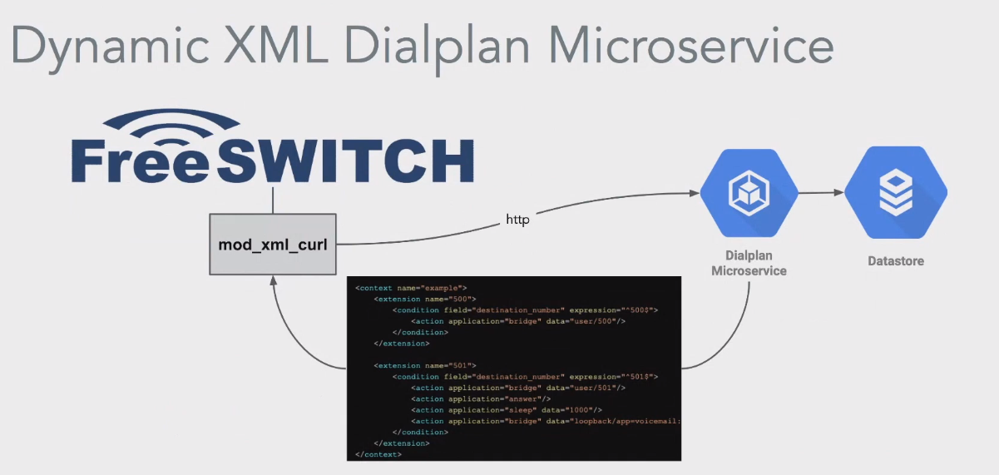

# FS and Kamailio in micorservices

Source https://www.youtube.com/watch?v=TV0G2iNjK3E

Talk how https://blog.voipxswitch.com/ is using FS&Kamailio in microservices over https://nsq.io/ using pub/sub.

## Fs and Kamailio communicate via NSQ as message broker.

## Dynamic XML dialplan

## Voicemail

## 

